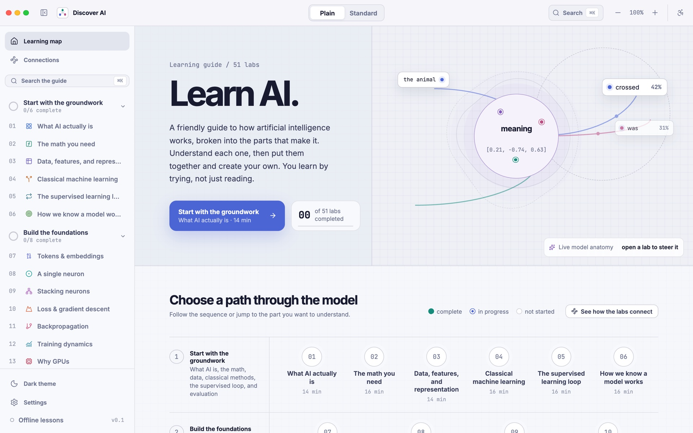
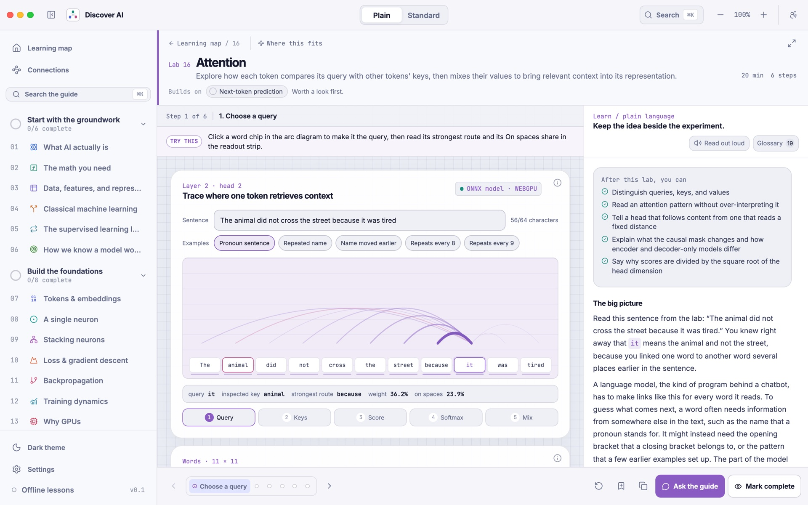
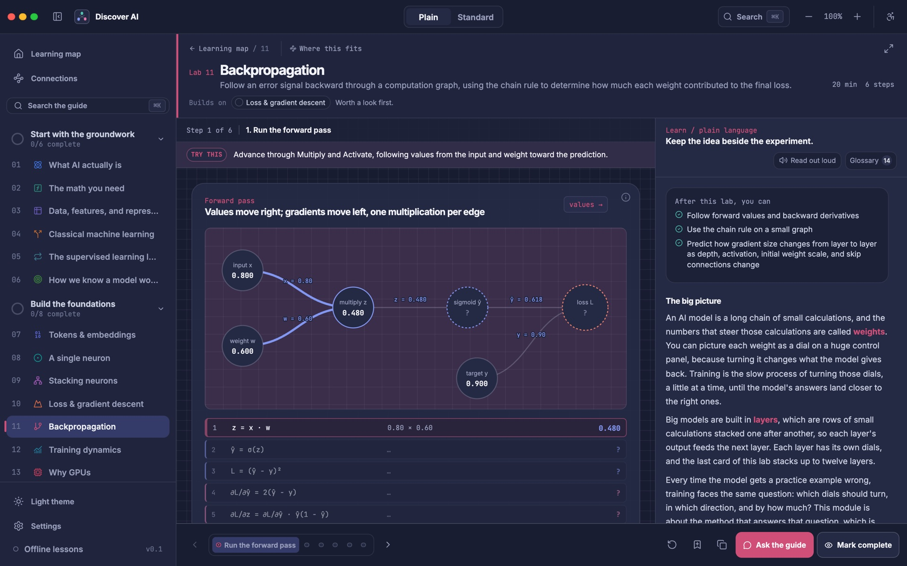
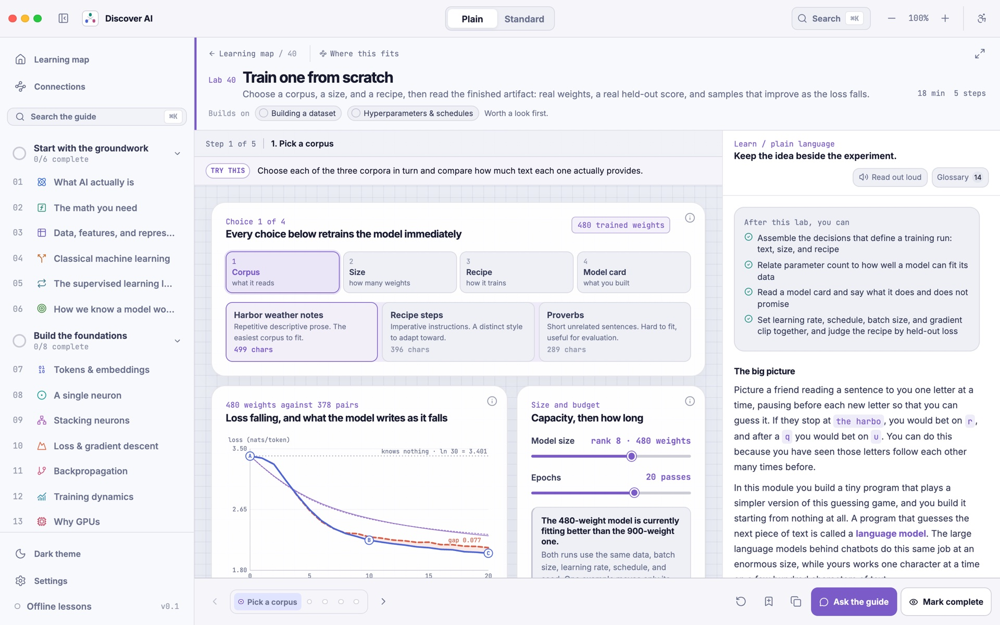
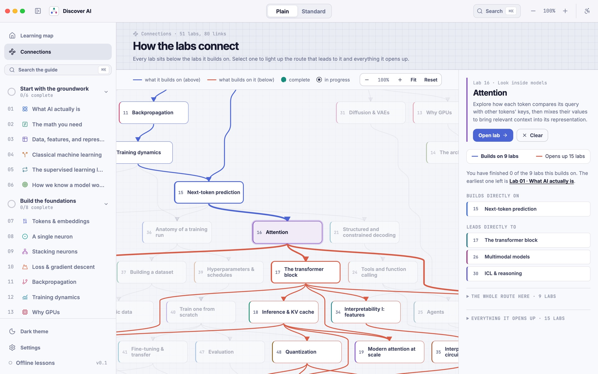
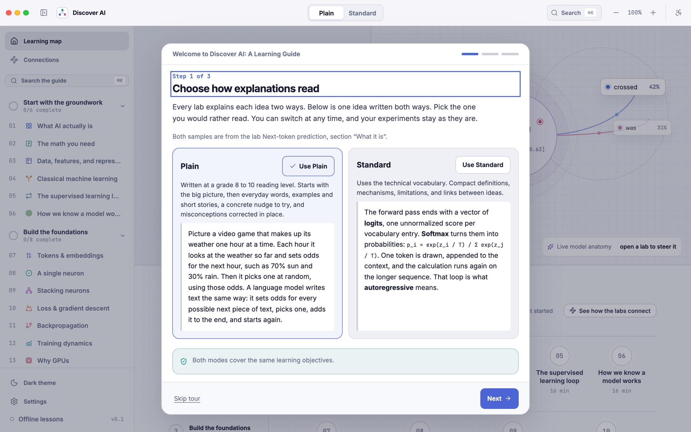

# Discover AI: A Learning Guide

A desktop app that teaches you how modern AI works by letting you play with it.

There are 51 small hands-on labs. In each one you move a slider, click a word, or train a tiny model, and you watch what changes. Next to every lab there is a short lesson that explains what you just saw. You can read it in plain everyday words or in the more technical version.



## About

I wanted to create a single place for anyone to learn AI. One that runs on your own computer, keeps track of what you've learned, lets you challenge yourself when you're ready, and makes hard ideas easier to understand through visuals and hands-on play.

## What's inside

The 51 labs are split into six groups. You can go in order or jump to whatever you're curious about.

| Group | What you'll learn |
| --- | --- |
| **Start with the groundwork** (1 to 6) | What AI is, the math you need, data and features, classic machine learning, the training loop, and how we know a model works |
| **Build the foundations** (7 to 14) | Tokens and embeddings, a single neuron, stacking neurons, loss and gradient descent, backpropagation, training dynamics, why GPUs matter, and the main model types |
| **Look inside models** (15 to 21) | Next-token prediction, attention, the transformer block, the KV cache, attention at scale, scaling laws, and structured decoding |
| **Build with a trained model** (22 to 27) | Search with embeddings, RAG, tools and function calling, agents, multimodal models, and failure modes and safety |
| **Explore the frontier** (28 to 35) | Reinforcement learning, post-training, in-context learning and reasoning, diffusion, the AI ecosystem, ethics, and interpretability |
| **Train and adapt a model** (36 to 51) | A full training run from start to finish: datasets, synthetic data, hyperparameters, training from scratch, fine-tuning, LoRA, model merging, instruction tuning, preference tuning, reasoning models, evaluation, quantization, distillation, serving, and a final "ship it" capstone |

## Screenshots

**Attention lab.** Click a word and see which other words it looks at. This one runs a real small transformer right in the app.



**Backpropagation lab, in dark theme.** Step through the forward pass and then follow the gradients backward, one calculation at a time.



**Train one from scratch.** Pick some text, a model size, and a training recipe. The model retrains on every change, so you can watch the loss fall and the samples get better.



**Connections map.** See how all 51 labs link together. Pick one to see what it builds on and what it leads to.



**Plain or Standard.** The welcome tour shows the same idea written both ways, so you can pick the one that suits you.



## Features

- **51 interactive labs.** Each lab is split into a few short steps with a "Try this" hint, so you always know what to do next.
- **Two ways to read.** Plain mode uses everyday words. Standard mode uses the proper technical terms. Switch at any time from the top bar.
- **Real models where it matters.** The attention lab runs a small trained transformer in the app. The training labs train a tiny language model live while you watch.
- **Checkpoints.** Short quizzes at the end of each lab to check what stuck.
- **Progress and snapshots.** Your progress is saved. You can save the state of any lab as a snapshot and come back to it later, or copy a link that opens the lab exactly as you left it.
- **Search everything.** Press `Cmd+K` on Mac or `Ctrl+K` on Windows and Linux to search labs, lessons, glossary terms, and settings.
- **Optional AI guide.** Ask questions about the lab you're on. Use a small model that runs on your computer, or connect your own OpenAI, Anthropic, or Google key. This is completely optional. Everything else works without it.
- **Built to be easy on everyone.** Light and dark themes, seven text sizes, high contrast, color-blind friendly palettes, reduced motion, keyboard support, and read-aloud.
- **Private and offline.** No account and no tracking. Lessons work without the internet, and your data stays on your computer.

## Getting started

You can run Discover AI in two ways. The web version is the quickest way to try it. The desktop app gives you everything, including the local AI guide.

### What you need

- [Node.js](https://nodejs.org/) version 20.19 or newer (version 22 or newer is best)
- [Git](https://git-scm.com/)
- For the desktop app only: Rust and the [Tauri prerequisites](https://v2.tauri.app/start/prerequisites/) for your system

### Option 1: Try it in your browser

```sh
git clone https://github.com/Fazmin/AILearningGuide.git
cd AILearningGuide
npm install
npm run dev
```

Then open [http://localhost:1420](http://localhost:1420) in your browser.

All the labs and lessons work here. The local AI guide and safe storage for API keys only work in the desktop app.

### Option 2: Run the desktop app

First install the [Tauri prerequisites](https://v2.tauri.app/start/prerequisites/) for your system. Then:

```sh
git clone https://github.com/Fazmin/AILearningGuide.git
cd AILearningGuide
npm install
npm run tauri dev
```

The first run takes a few minutes because Rust has to compile everything. After that it starts much faster.

### Build an installer

To make an app you can install and share:

```sh
npm run tauri build
```

You'll find the result in `src-tauri/target/release/bundle/`.

## How to use it

1. **Pick a reading mode.** The welcome tour asks if you want Plain or Standard. You can change it any time with the switch at the top.
2. **Open a lab.** Start at lab 1 from the home screen, or pick any lab from the sidebar.
3. **Follow the steps.** Each lab has a few steps at the bottom. Read the "Try this" hint, play with the controls, and see what happens.
4. **Read along.** The Learn panel on the right explains what you're seeing. Open the Glossary to look up key words, or use "Read out loud" to listen instead.
5. **Check yourself.** Take the checkpoint at the end, then click "Mark complete".
6. **See the big picture.** Open "Connections" in the sidebar to see how the labs fit together and what to learn next.

### Setting up the AI guide (optional)

Open **Settings** in the desktop app.

- **Local model.** One click downloads a small open model (Qwen3.5 2B, about 1.3 GB) and the llama.cpp engine to run it. Both files are checked before they run. After that the guide works fully offline and nothing you type leaves your computer.
- **Cloud providers.** Add your own OpenAI, Anthropic, or Google API key if you prefer a bigger model. Keys are saved in your system's keychain, not in a file.

Once it's set up, click **Ask the guide** in any lab. The guide knows which lab you're on and what you're looking at.

## For developers

### Project layout

```text
src/
  components/      the app shell: home, sidebar, settings, lab frame
  modules/<lab>/   one folder per lab: the interactive, lessons, and checkpoint
  module-sdk/      shared building blocks the labs use (charts, the tiny trainable model)
  model-runtime/   runs the small ONNX models in a background worker
  store/           saved settings, progress, and snapshots
src-tauri/         the desktop side (Rust): database, keychain, local AI setup
models/            Python scripts that train and export the small teaching models
scripts/           checks, search index builder, and the new lab generator
docs/              how the app is built and how labs and lessons are written
docs/screenshots/  images used in this README
```

### Run the checks

```sh
npm run check
cd src-tauri && cargo test
```

`npm run check` checks every lab's files and content, the reading level of the Plain lessons, the search index, the license list, the model files, types, and the tests. It needs `python3` for the model file check.

### Add a new lab

```sh
npm run new:module -- my-new-lab
npm run check:modules
```

This creates a new folder in `src/modules/` with everything a lab needs. The app finds it on its own, so you don't have to register it anywhere. Read [MODULE_AUTHORING.md](docs/MODULE_AUTHORING.md) for how labs work and [CONTENT_STYLE_GUIDE.md](docs/CONTENT_STYLE_GUIDE.md) for how the lessons are written.

### Retrain the teaching models

You don't need to do this to run the app. The trained models are already included. If you want to rebuild them yourself, see [models/README.md](models/README.md) and [models/MODEL_CARD.md](models/MODEL_CARD.md).

### More details

[ARCHITECTURE.md](docs/ARCHITECTURE.md) explains how the pieces fit together.

### Built with

- [Tauri 2](https://tauri.app/) and Rust for the desktop app
- [React](https://react.dev/), TypeScript, and [Vite](https://vite.dev/) for the interface
- [MDX](https://mdxjs.com/) for the lessons
- [ONNX Runtime Web](https://onnxruntime.ai/) for running the small models
- [llama.cpp](https://github.com/ggml-org/llama.cpp) for the optional local AI guide
- SQLite for saving your progress

## Contributing

Ideas, bug reports, and fixes are all welcome, and you don't need to be an AI expert to help. Pointing out a lesson that didn't make sense to you is one of the most useful things you can do.

- Found a bug or a mistake in a lesson? [Open an issue](https://github.com/Fazmin/AILearningGuide/issues) and tell me which lab and what you saw.
- Want to fix something? Fork the repo, make your change on a new branch, run `npm run check`, and open a pull request.
- Want to add a lab? Please open an issue first so we can talk about it.

[CONTRIBUTING.md](CONTRIBUTING.md) has the details: how to set up, which checks to run, and how lessons and labs are written.

## License

Discover AI is released under the [MIT License](LICENSE). You're free to use it, change it, and share it.

The app also uses open source libraries, fonts, models, and datasets that have their own licenses. You can see the full list inside the app under **Settings > About**.

## Thanks

Thanks to everyone who builds and shares open tools, models, and datasets. This project would not exist without them.

## Cite this project

If you use Discover AI in your work, teaching, or writing, you can use this reference:

```bibtex
@software{discover_ai_2026,
  title  = {Discover AI: A Learning Guide},
  author = {{Discover AI contributors}},
  year   = {2026},
  url    = {https://github.com/Fazmin/AILearningGuide},
  note   = {An interactive desktop app for learning how modern AI works}
}
```
